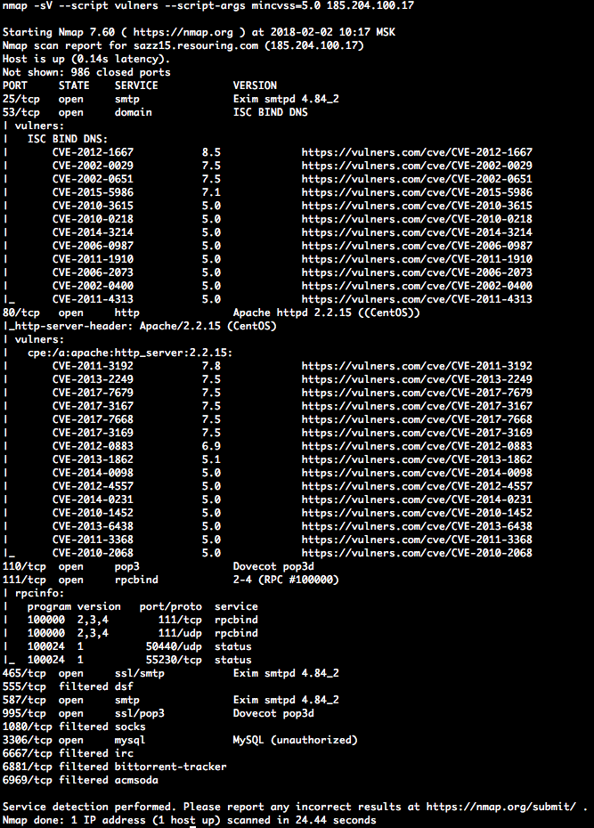
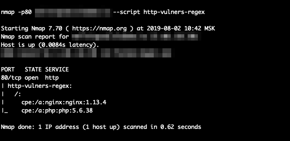
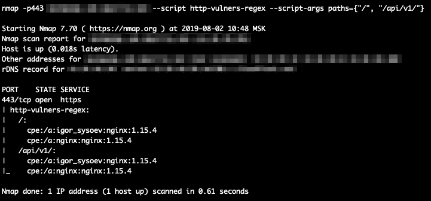

# nmap_vulners

 

## Description

NSE script uses info about known services to provide data on vulnerabilities. Note that it is already included into the standard nmap NSE library.

## Dependencies:
    nmap libraries:
        http
        json
        string
    http-vulners-regex

Keep in mind that the script depends on having information about software versions, so it only works with -sV flag.

**NB:** Now it can actually be run without -sV flag if http-vulners-regex script is run as well.

## Installation
    locate where your nmap scripts are located on your system
        for *nix system it might be  ~/.nmap/scripts/ or $NMAPDIR
        for Mac it might be /usr/local/Cellar/nmap/<version>/share/nmap/scripts/
        for Windows it might be C:\Program Files (x86)\Nmap\scripts
    copy the provided script (vulners.nse) into that directory
    run *nmap --script-updatedb* to update the nmap script DB 

## Usage
    Use it as straightforward as you can:
        nmap -sV --script vulners [--script-args mincvss=<arg_val>] <target>
        
It is KISS after all.

# http-vulners-regex

## Description

NSE script scans HTTP responses and identifies CPEs for the mentioned software. It can therefore boost the efficiency of the main vulners script.

Or with the paths:

## Dependencies
    nmap libraries:
        http
        json
        string
        stdnse
        shortport
        table

## Installation
    locate where nmap is located on your system
        for *nix system it might be  ~/.nmap/ or $NMAPDIR
        for Mac it might be /usr/local/Cellar/nmap/<version>/share/nmap/
        for Windows it might be C:\Program Files (x86)\Nmap\
    copy the provided script (http-vulners-regex.nse) into <nmap_dir>/scripts/
    copy the provided json with the regexes to <nmap_dir>/nselib/data/
    copy the provided txt file with the default paths to <nmap_dir>/nselib/data/
        note that you can specify your own file via command line
    run *nmap --script-updatedb* to update the nmap script DB 

## Usage
    As a usual NSE script:
        nmap --script http-vulners-regex.nse [--script-args paths={"/"}] <target> 

# vulners_enterprise

## Description 
This is basically the good old faithfull nmap-vulners from above with one exception: it requires an API_KEY to work. 

You can either specify it on the CLI using the 'api_key' script argument, set it into an envirotnment variable VULNERS_API_KEY, or store it in a file readable by the user running nmap. In this case you must specify the absolute path to the file using the 'api_key_file' script argument.

## Usage
    As a usual NSE script:
        nmap -sV --script vulners_enterprise [--script-args mincvss=<arg_val>,api_key=<api_key>,api_key_file=<absolute_path>,api_host=http://my_host.com] <target>
        
### NSE Arguments

**vulners_enterprise.mincvss** Limit CVEs shown to those with this CVSS score or greater.

**vulners_enterprise.api_key** API token to be used in the requests

**vulners_enterprise.api_key_file** Absolute path to the file with a single line containing the API token

**vulners_enterprise.api_host** URL to vulners API without the leading slash. Defaults to https://vulners.com

